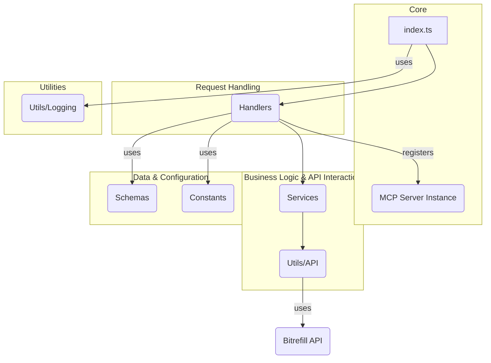

# System Patterns: Bitrefill MCP Server

## 1. Architecture Overview

The server follows a modular structure, separating concerns into distinct directories:

## 2. Key Technical Decisions

- **MCP SDK:** Uses `@modelcontextprotocol/sdk` for core server implementation and communication.
- **Stdio Transport:** Leverages `StdioServerTransport` for communication, suitable for process-based integration.
- **Modular Handlers:** Request handling logic is separated into `handlers/resources.ts` and `handlers/tools.ts`, registered in `index.ts`.
- **Service Layer:** Business logic and direct API interactions are encapsulated within the `services/` directory.
- **Utility Functions:** Common functionalities like API calls (`utils/api.ts`) and logging (`utils/index.ts`) are abstracted.
- **Schema Definitions:** Input/output validation likely uses schemas defined in `schemas/`.
- **Constants:** Static data like categories or payment methods are stored in `constants/`.

## 3. Design Patterns

- **Dependency Injection (Implicit):** The `McpServer` instance is passed to handler registration functions.
- **Service Layer:** Separates API interaction logic from request handling.
- **Modular Design:** Code is organized by feature/concern (handlers, services, utils, schemas, constants).

## 4. Component Relationships

- `index.ts`: Entry point, initializes the server, registers handlers, manages lifecycle.
- `handlers/`: Contains functions that respond to MCP requests (ListTools, CallTool, ListResources, ReadResource). They orchestrate calls to services and format responses.
- `services/`: Implements the core logic for each feature (search, product details, invoice creation) by interacting with the Bitrefill API via `utils/api.ts`.
- `utils/`: Provides reusable helper functions, notably the API client wrapper and logging.
- `schemas/`: Defines the expected structure for tool inputs and potentially API responses, used for validation.
- `constants/`: Holds static data used across the application.
